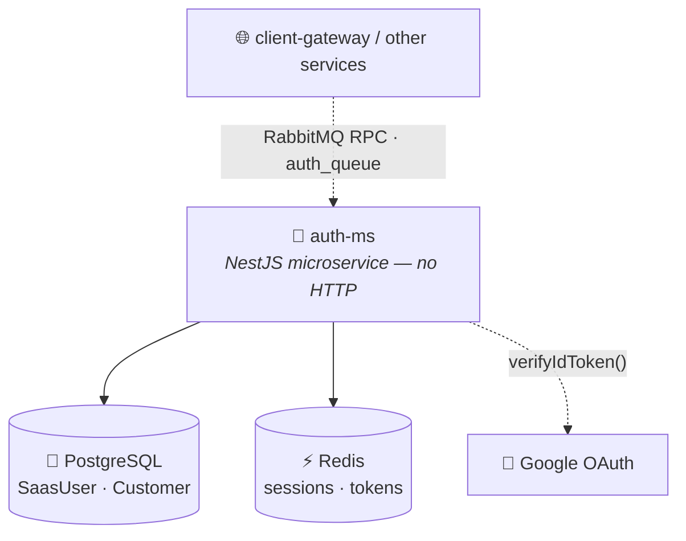
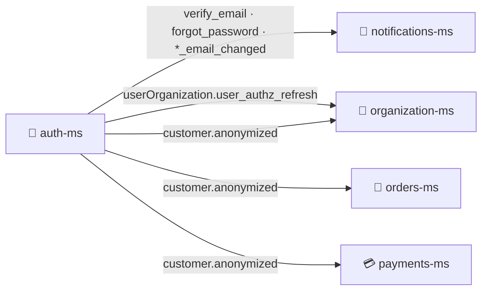

<h1 align="center">🔐 Auth Microservice · <code>auth-ms</code></h1>

<p align="center">
  <b>NestJS authentication microservice</b> — user authentication, sessions, profiles, JWT management,<br/>
  OAuth login and account-lifecycle events for a multi-tenant commerce platform.
</p>

<p align="center">
  
  
  
  
  
</p>

<p align="center">
  
  
  
  
</p>

<br/>

## 📌 Purpose

`auth-ms` is a **message-driven authentication microservice** managing authentication flows for two distinct user domains:

- 🏢 **SaaS platform users** (`SaasUser`)
- 👤 **Organization customers** (`Customer`)

> [!IMPORTANT]
> This is a **pure RabbitMQ microservice** — it starts with `NestFactory.createMicroservice()` and has **no REST controllers, no HTTP endpoints, and no HTTP listener**. The `PORT` env var is used only in a startup log line. All communication uses `@MessagePattern()` over RabbitMQ.

<br/>

## ✨ Main Responsibilities

| Area | Responsibilities |
|---|---|
| 🔑 **Authentication** | Registration · email/password login · Google OAuth · JWT access tokens · refresh-token rotation · password reset · email verification · email-change confirmation |
| 🗝️ **Session Management** | Redis-backed sessions · logout current · logout all · list active sessions · revoke sessions |
| 🏢 **SaaS Users** | Profile management · account activation/deactivation · profile restoration |
| 👤 **Customers** | Organization-based profiles · customer administration · soft delete / restore · anonymization events |

<br/>

## 🏗️ Architecture



<br/>

## 🛠️ Tech Stack

| Technology | Purpose |
|---|---|
| **NestJS 11** | Microservice framework |
| **TypeScript** | Programming language |
| **RabbitMQ** + `@nestjs/microservices` | Message transport (RMQ) |
| **PostgreSQL** + **TypeORM 0.3** | Persistent storage / ORM |
| **Redis** + **ioredis** | Session / token storage |
| **JWT** · **bcrypt** | Auth tokens · password hashing |
| **Google OAuth** | Social authentication |
| `class-validator` · `class-transformer` | DTO validation / transformation |
| **Zod** | Environment validation |
| **Jest** + **ts-jest** | Testing |

<br/>

## 📦 Installation & Running

```bash
npm install
cp .env.example .env        # fill required values before starting
```

| Mode | Command |
|---|---|
| 🧑‍💻 Development | `npm run start:dev` |
| 🐞 Debug | `npm run start:debug` |
| 🚀 Production | `npm run build && npm run start:prod` |

<details>
<summary><b>🐳 Docker</b></summary>

<br/>

- **Image:** `node:20-alpine3.19`
- **Container port:** `4002`
- **Dependencies:** PostgreSQL

> The exposed port does **not** represent an HTTP server — communication happens through RabbitMQ.

</details>

<br/>

## 🧪 Testing

```bash
npm run test          # unit tests
npm run test:watch
npm run test:cov
npm run test:debug
npm run test:e2e
```

> [!WARNING]
> **Current state:** `customer.service.spec.ts` exists, but there is **no `test/` directory and no `jest-e2e.json`**, so `npm run test:e2e` fails due to the missing configuration file.

<br/>

## 🔐 Environment Variables

Validated using `src/config/envs.ts` — **the application exits if required variables are missing.**

| Variable | Required | Description |
|---|:---:|---|
| `NODE_ENV` | ✅ | Runtime environment |
| `PORT` | ❌ | Startup log only |
| `DB_HOST` | ✅ | PostgreSQL host |
| `DB_PORT` | ❌ | PostgreSQL port |
| `POSTGRES_USER` | ✅ | Database user |
| `POSTGRES_PASSWORD` | ✅ | Database password |
| `POSTGRES_DB` | ✅ | Database name |
| `JWT_SECRET_ACCESS` | ✅ | Access token secret |
| `JWT_SECRET_REFRESH` | ✅ | Refresh token secret |
| `JWT_SECRET_VERIFY_EMAIL` | ✅ | Email verification secret |
| `RABBITMQ_URL` | ✅ | RabbitMQ connection |
| `RABBITMQ_QUEUE` | ✅ | Incoming queue |
| `REDIS_HOST` | ✅ | Redis host |
| `REDIS_PORT` | ❌ | Redis port |
| `REDIS_PASS` | ✅ | Redis password |
| `GOOGLE_CLIENT_ID` | ✅ | Google OAuth client |
| `VERIFY_EMAIL_URL` | ✅ | Email verification URL |
| `RESET_PASSWORD_URL` | ✅ | Password reset URL |

<details>
<summary><b>📄 Example <code>.env</code></b></summary>

<br/>

```env
NODE_ENV=development

DB_HOST=localhost
DB_PORT=5432
POSTGRES_USER=postgres
POSTGRES_PASSWORD=password
POSTGRES_DB=auth

JWT_SECRET_ACCESS=secret
JWT_SECRET_REFRESH=secret
JWT_SECRET_RESET=secret
JWT_SECRET_VERIFY_EMAIL=secret

RABBITMQ_URL=amqp://localhost:5672
RABBITMQ_QUEUE=auth_queue

REDIS_HOST=localhost
REDIS_PORT=6379
REDIS_PASS=password

GOOGLE_CLIENT_ID=my-google-client

VERIFY_EMAIL_URL=https://app.com/verify
RESET_PASSWORD_URL=https://app.com/reset
```

</details>

<br/>

## 📨 Incoming RabbitMQ Patterns

All incoming communication uses `@MessagePattern()` — no HTTP routes exist.

<details>
<summary><b>🏢 SaaS Authentication</b> — <code>src/auth/saas-auth</code></summary>

<br/>

| Pattern | Description |
|---|---|
| `auth.saas.register` | Register SaaS user |
| `auth.saas.verify_email` | Verify email |
| `auth.saas.resend_verification` | Resend verification |
| `auth.saas.login` | Login |
| `auth.saas.refresh` | Refresh tokens |
| `auth.google` | Google OAuth login |
| `auth.saas.change_password` | Change password |
| `auth.saas.forgot_password` | Forgot password |
| `auth.saas.reset_password` | Reset password |
| `saas.auth.change-email.request` | Request email change |
| `saas.auth.change-email.confirm` | Confirm email change |

</details>

<details>
<summary><b>👤 Customer Authentication</b> — <code>src/auth/customer-auth</code></summary>

<br/>

| Pattern | Description |
|---|---|
| `auth.customer.register` | Register customer |
| `auth.customer.login` | Login |
| `auth.customer.refresh` | Refresh token |
| `auth.google` | Google OAuth login |
| `auth.customer.change_password` | Change password |
| `auth.customer.forgot_password` | Forgot password |
| `auth.customer.reset_password` | Reset password |
| `customer.auth.verify-email` | Verify email |
| `customer.auth.resend-verification` | Resend verification |
| `customer.auth.change-email.request` | Request email change |
| `customer.auth.change-email.confirm` | Confirm email change |

</details>

<details>
<summary><b>🗝️ Session Management</b> — <code>src/session</code></summary>

<br/>

| Pattern | Description |
|---|---|
| `auth.session.logout` | Logout current session |
| `auth.session.logout-all` | Logout all sessions |
| `session.list` | List active sessions |
| `session.revoke` | Revoke session |

</details>

<details>
<summary><b>👥 SaaS User Profile</b> — <code>src/user</code></summary>

<br/>

| Pattern | Description |
|---|---|
| `auth.saas.user.get_profile` | Get profile |
| `auth.saas.user.update` | Update user |
| `auth.saas.user.deactivate` | Soft delete |
| `auth.saas.user.restore` | Restore user |

</details>

<details>
<summary><b>👥 Customer Profile</b> — <code>src/customer</code></summary>

<br/>

| Pattern | Description |
|---|---|
| `auth.customer.user.create` | Create customer |
| `auth.customer.user.get_all_profiles` | List customers |
| `auth.customer.user.get_profile` | Get profile |
| `auth.customer.user.update` | Update customer |
| `auth.customer.user.delete` | Delete customer |
| `auth.customer.user.soft-delete` | Soft delete |
| `auth.customer.user.restore` | Restore customer |
| `auth.customer.user.growth_by_admin` | Customer growth stats |

</details>

<br/>

## 📤 Outgoing Events

Published with `ClientProxy.emit()`.



| Group | Queue | Events | Consumer(s) |
|---|---|---|---|
| **Notifications** | `RMQ_EVENTS_QUEUE_NOTIFICATIONS` | `verify_email.saas`, `forgot_password.saas`, `saas_mailer_email_changed`, `verify_email.customer`, `forgot_password.customer`, `customer_mailer_email_changed` | notifications-ms |
| **Authorization** | `RMQ_EVENTS_QUEUE_AUTHZ` | `userOrganization.user_authz_refresh` | organization-ms |
| **Anonymization** | `RMQ_EVENTS_QUEUE_ORDERS`, `RMQ_EVENTS_QUEUE_PAYMENTS`, `RMQ_EVENTS_QUEUE_ORGANIZATION` | `customer.anonymized` | orders-ms · payments-ms · organization-ms |

<br/>

## 🔌 External Dependencies

| Dependency | Usage |
|---|---|
| 🐘 **PostgreSQL** | TypeORM entities `SaasUser`, `Customer`. Dev uses `synchronize: true`; production requires migrations. |
| ⚡ **Redis** (`ioredis`) | Sessions, token storage, temporary authentication state |
| 🐇 **RabbitMQ** | Incoming authentication requests + outgoing domain events |
| 🔵 **Google OAuth** (`google-auth-library`) | `Google ID Token → verifyIdToken() → user authentication` |

<br/>

## 📁 Project Structure

```
auth-ms/
└── src/
    ├── auth/
    │   ├── saas-auth/
    │   ├── customer-auth/
    │   └── oauth/
    ├── customer/
    ├── user/
    ├── session/
    ├── redis/
    ├── config/
    ├── database/
    └── main.ts
```

<br/>

## ⚠️ Known Limitations / TODO

> [!WARNING]
> These are tracked openly and should be verified before production.

- **Env vars missing from `.env.example`:** `JWT_SECRET_VERIFY_EMAIL`, `REDIS_PASS`, `RMQ_EVENTS_QUEUE_ORDERS`, `RMQ_EVENTS_QUEUE_PAYMENTS`, `RMQ_EVENTS_QUEUE_ORGANIZATION`.
- **Google OAuth pattern collision:** both `SaaSAuthController` and `CustomerAuthController` register `auth.google`, which may create a routing conflict.
- **Mailer dependencies:** `@nestjs-modules/mailer`, `nodemailer`, `handlebars` are installed, but `src/custom-mailer/` does not exist and the build script references missing templates.
- **Missing SaaS user handlers:** patterns `GET_ALL_PROFILES` and `DELETE` are defined but have no controller handlers.
- **Database migrations:** no migration files found; production migration strategy should be verified.

<br/>

## ✅ Service Status

| Feature | Status |
|---|:---:|
| JWT authentication | ✅ |
| Refresh tokens | ✅ |
| Redis sessions | ✅ |
| PostgreSQL persistence | ✅ |
| Google OAuth | ✅ |
| RabbitMQ messaging | ✅ |
| SaaS authentication | ✅ |
| Customer authentication | ✅ |
| Event publishing | ✅ |
| HTTP API | ❌ Not exposed |
| Automated tests | ⚠️ Partial |

<p align="center">
  
</p>